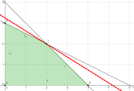

## Pagina de programacion lineal

En esta pagina pondre las cosas que estamos haciendo en el curso de programacion lineal

### hoy aprendimos a usar sympy

### Enlaces

[Pagina de python](https://www.python.org/)
[Github](ww.github.com/)

### Problemas

Maximizar $$z=x_{1}+x_{2}$$

sujeto a $$x_1\geq 3$$